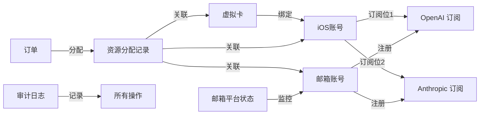

# Franxx Store 后台管理系统 - 业务模型与数据库设计

## 一、业务模型详解

### 1.1 业务定位

Franxx Store 是一个为中国开发者提供 AI 订阅服务的跨区平台，通过尼日利亚区 iOS 订阅绕过地区限制，提供 ChatGPT、Claude、Gemini 等 AI 服务的订阅管理。

### 1.2 核心资源体系

```plain
虚拟卡（支付能力）
    ↓ [绑定]
iOS账号（购买渠道）
    ↓ [订阅]
AI服务订阅（ChatGPT/Claude/Gemini）
    ↑ [使用]
邮箱账号（AI服务账号基础）
```

### 1.3 订阅模式

1. **标准订阅**：用户购买完整账号，我们提供预注册的邮箱账号
2. **代订阅服务**（Lv3 会员专享）：用户提供自己的账号，我们帮助开通订阅
3. **双人组队模式（FRANXX Pair）**：
   - 两人组成一台 FRANXX，共享彼此的订阅权益
   - A 的 ChatGPT + B 的 Claude = 双方都能使用两个服务
   - 不涉及费用分摊，各自维护自己的订阅
4. **FRANXX 小队模式**（6 人团购）：
   - 6 人组成一个完整的 FRANXX 小队
   - 享受总价 85% 的团购价（相当于每人节省 15%）
   - 可混合订阅不同服务（ChatGPT/Claude/Gemini）
   - 队长负责统一管理和费用收取

### 1.4 关键业务规则

- **iOS 账号限制**：每个 iOS 账号最多订阅 1 个 OpenAI 服务（ChatGPT）+ 1 个 Anthropic 服务（Claude）。
- **支付渠道**：所有订阅通过 iOS App 内购（利用尼日利亚区价格优势）
- **账号回收**：订阅到期后保留 3 天供用户续费，之后可回收重新分配
- **续费策略**：默认取消自动续费，用户主动续费时跟进
- **风控管理**：iOS 账号注册后有 24/48/72 小时风控期
- **异常处理**：邮箱在特定平台被 ban 时，标记状态并处理退款

### 1.5 商业模式与折扣体系

我们的核心商业模式是在原价售卖的基础上，通过多层次的折扣优惠体系吸引和留存用户：

#### 1.5.1 折扣类型

1. **会员等级折扣**
   - Lv1（新用户）：原价
   - Lv2（订阅 3 个月）：95% 折扣
   - Lv3（订阅 6 个月）：90% 折扣
   - Lv4（订阅 12 个月）：85% 折扣
   - Lv5（FRANXX 精英）：80% 折扣

2. **折扣码系统**
   - 新用户专享码：首单 9 折
   - 节日促销码：特定节日 8.5 折
   - 推荐奖励码：推荐新用户获得 8.8 折
   - 限时闪购码：限量发放 7.5 折

3. **团队权益**
   - 2 人 FRANXX Pair：互享订阅权益（非折扣）
   - 6 人 FRANXX 小队：85 折（总价的 85%）
   - 企业批量采购（10+ 账号）：总价 70%

4. **长期订阅优惠**
   - 季付：95% 折扣
   - 半年付：90% 折扣
   - 年付：85% 折扣

#### 1.5.2 折扣应用规则（最低价单选）

- 分别计算三类折扣后的应付价：会员等级折扣、折扣码（如有）、小队折扣。
- 仅应用一种折扣：三者取最低价格（不叠加）。
- 可选安全底价：如需保护毛利，可设置最低成交价下限（例如标价的 65%）。

#### 1.5.3 会员成长体系

- 订阅时长累计升级
- 推荐新用户加速升级
- 参与社区活动获得经验值
- 高等级会员享有优先客服、资源分配等特权

## 二、业务流程

### 2.1 资源准备流程

1. 采购虚拟卡，录入系统
2. 注册 iOS 账号，绑定虚拟卡
3. 批量注册邮箱账号
4. 使用邮箱注册 AI 服务免费账号
5. 等待 iOS 账号度过风控期

### 2.2 订单处理流程

1. 用户下单选择服务类型（ChatGPT/Claude/Gemini）
2. 系统/管理员从资源池分配：
   - 选择可用的邮箱账号（已注册对应 AI 服务）
   - 选择有空闲订阅位的 iOS 账号
3. 通过 iOS 账号在 App 内为该邮箱购买订阅
4. 记录订阅信息，标记资源占用状态
5. 交付账号信息给用户

### 2.3 续费管理流程

1. 订阅即将到期时通知用户
2. 用户选择续费：
   - 保持原账号不变
   - 通过同一 iOS 账号续费
3. 用户不续费：
   - 进入 3 天保留期
   - 保留期后释放资源，可重新分配

### 2.4 异常处理流程

1. 邮箱被特定平台 ban：
   - 标记该邮箱在该平台的状态为 banned
   - 联系平台申请退款
   - 为用户重新分配资源或退款
2. iOS 账号风控：
   - 标记风控状态
   - 等待风控期结束后使用

## 三、数据库设计

### 3.1 账单地址表 (billing_addresses)

```sql
- id                 UUID PK         // 主键
- street             TEXT            // 街道地址
- city_or_town       TEXT            // 城市
- state_or_county    TEXT            // 州/郡（如 Jigawa）
- postcode           TEXT            // 邮编
- country            TEXT            // 国家
- status             ENUM            // active/inactive
- notes              TEXT            // 备注
- created_at         TIMESTAMPTZ
- updated_at         TIMESTAMPTZ

-- 索引
CREATE INDEX idx_billing_addresses_country ON billing_addresses(country);
CREATE INDEX idx_billing_addresses_status ON billing_addresses(status);
```

### 3.2 虚拟卡管理表 (virtual_cards)

```sql
- id                   UUID PK         // 主键
- pan_encrypted        TEXT UNIQUE     // 加密后的完整卡号（PAN）
- last4                TEXT            // 后四位（展示用）
- brand                ENUM            // visa/mastercard/amex/... 
- expiry_date          DATE            // 到期日期
- cvv_encrypted        TEXT            // 加密后的 CVV
- provider             TEXT            // 供应商(gomoney/timon/feiyangka)
- holder_name          TEXT            // 持卡人姓名
- balance              DECIMAL(10,2)   // 余额
- currency             ENUM            // NGN/USD
- status               ENUM            // active/frozen/expired/cancelled
- billing_address_id   UUID FK         // 关联账单地址
- monthly_limit        DECIMAL(10,2)   // 月限额
- used_this_month      DECIMAL(10,2)   // 本月已用
- notes                TEXT            // 备注
- created_at           TIMESTAMPTZ     
- updated_at           TIMESTAMPTZ
```

说明：PAN（Primary Account Number）即银行卡完整卡号。上述敏感字段需加密存储，仅管理员可见。

### 3.3 iOS 账号管理表 (ios_accounts)

```sql
- id                   UUID PK         // 主键
- apple_id             TEXT UNIQUE     // Apple ID
- password             TEXT            // 密码(加密存储)
- region               ENUM            // NG/US/GB/JP
- phone_number         TEXT            // 关联电话
- virtual_card_id      UUID FK         // 关联虚拟卡
- status               ENUM            // active/locked/risk_control/suspended
- slot_combo           ENUM            // none/openai_only/anthropic_only/both
- risk_control_until   TIMESTAMPTZ     // 风控结束时间
- device_info          JSONB           // 关联设备信息
- last_login_at        TIMESTAMPTZ     // 最后登录时间
- total_spent          DECIMAL(10,2)   // 总消费金额
- notes                TEXT            // 备注
- created_at           TIMESTAMPTZ
- updated_at           TIMESTAMPTZ

一致性建议：当 `status != 'active'` 时，强制 `slot_combo = 'none'`（实现时用 CHECK 约束）。
```

### 3.4 邮箱账号管理表 (email_accounts)

```sql
- id                 UUID PK         // 主键
- email              TEXT UNIQUE     // 邮箱地址
- password           TEXT            // 密码(加密存储)
- phone_number       TEXT            // 关联电话
- recovery_email     TEXT            // 恢复邮箱
- status             ENUM            // available/allocated/reserved/recycled
- allocation_status  ENUM            // 分配状态
- current_user_id    UUID FK         // 当前分配的用户
- allocated_at       TIMESTAMPTZ     // 分配时间
- reserved_until     TIMESTAMPTZ     // 保留截止时间(到期后3天)
- notes              TEXT            // 备注
- created_at         TIMESTAMPTZ
- updated_at         TIMESTAMPTZ
```

### 3.5 邮箱平台状态表 (email_platform_status)

```sql
- id                 UUID PK         // 主键
- email_account_id   UUID FK         // 关联邮箱账号
- platform           ENUM            // openai/anthropic
- status             ENUM            // active/banned/suspended
- banned_at          TIMESTAMPTZ     // 封禁时间
- ban_reason         TEXT            // 封禁原因
- registered_at      TIMESTAMPTZ     // 在该平台注册时间
- last_active_at     TIMESTAMPTZ     // 最后活跃时间
- created_at         TIMESTAMPTZ
- updated_at         TIMESTAMPTZ

UNIQUE(email_account_id, platform)     // 联合唯一索引
```

### 3.6 产品表 (products)

```sql
- id                 UUID PK         // 主键
- name               TEXT            // 产品名称（如 ChatGPT Plus、Claude Pro）
- platform           ENUM            // openai/anthropic（决定占用哪个 iOS 槽位提供方）
- tag                ENUM            // 服务标识（chatgpt/claude/codex/claude_code）
- ios_ngn_price      DECIMAL(10,2)   // iOS商店尼日利亚价格（成本）
- ios_usd_price      DECIMAL(10,2)   // iOS换算USD价格（成本）
- web_usd_price      DECIMAL(10,2)   // 网页版USD价格（参考）
- selling_price      DECIMAL(10,2)   // 我们的售价（USD）
- stock_quantity     INTEGER         // 库存数量
- reserved_quantity  INTEGER         // 已预留（下单未支付）
- sold_quantity      INTEGER         // 已售出数量
- status             ENUM            // on_sale/sold_out/discontinued
- description        TEXT            // 产品描述
- created_at         TIMESTAMPTZ
- updated_at         TIMESTAMPTZ
```

### 3.7 订单表 (orders)

```sql
- id                 UUID PK         // 主键
- user_id            UUID FK         // 下单用户
- product_id         UUID FK         // 购买的产品
- subscription_id    UUID FK         // 关联订阅
- type               ENUM            // new/renewal（新购/续费）
- amount             DECIMAL(10,2)   // 标价（折扣前）
- final_amount       DECIMAL(10,2)   // 折扣后成交价
- discount_type      ENUM            // 已应用的折扣：membership/code/squad/none
- discount_snapshot  JSONB           // 折扣计算快照（便于审计/复算）
- currency           ENUM            // USD/CNY
- payment_status     ENUM            // pending/paid/partially_refunded/refunded/canceled（由 payments 汇总得到）
- delivery_status    ENUM            // pending/processing/delivered/failed
- stripe_session_id  TEXT            // Stripe 支付会话ID
- notes              TEXT            // 备注
- created_at         TIMESTAMPTZ
- paid_at            TIMESTAMPTZ
- delivered_at       TIMESTAMPTZ
```

#### 3.7.1 支付表 (payments)

用于记录该订单的所有支付尝试、成功与退款流水，`orders.payment_status` 为从本表汇总出的“快照”，便于快速查询。

```sql
- id                        UUID PK         // 主键
- order_id                  UUID FK         // 关联订单
- provider                  ENUM            // stripe（唯一）
- kind                      ENUM            // charge/refund
- amount                    DECIMAL(10,2)   // 金额（正数；退款以 kind 区分方向）
- currency                  ENUM            // USD/CNY
- status                    ENUM            // pending/authorized/succeeded/failed/canceled/disputed/refunded/partially_refunded
- stripe_session_id         TEXT            // Checkout Session (cs_...)
- stripe_payment_intent_id  TEXT            // PaymentIntent (pi_...)
- stripe_charge_id          TEXT            // Charge (ch_...)，仅扣款行填
- stripe_refund_id          TEXT            // Refund (re_...)，仅退款行填
- stripe_customer_id        TEXT            // Customer (cus_...)，如有
- stripe_event_id           TEXT            // Webhook 事件ID (evt_...)，做幂等
- error_message             TEXT            // 失败原因（可选）
- occurred_at               TIMESTAMPTZ     // 事件发生时间
- created_at                TIMESTAMPTZ
- updated_at                TIMESTAMPTZ

-- 推荐约束/索引（实现时落地）：
-- UNIQUE(stripe_event_id)
-- UNIQUE(stripe_charge_id) WHERE kind = 'charge'
-- UNIQUE(stripe_refund_id) WHERE kind = 'refund'
-- INDEX(order_id, created_at DESC)
```

#### 3.7.2 Stripe Checkout 流程（一次性支付）

1) 服务器端创建 Checkout Session（`mode=payment`），金额以服务端计算好的 `final_amount` 为准；`success_url` 使用模板 `?session_id={CHECKOUT_SESSION_ID}`。
2) 前端跳转至 Session URL，用户在 Stripe Checkout 完成支付。
3) 服务器监听 Webhook 并原子更新 `orders/payments`：
   - `checkout.session.completed`：记录/确认支付并关联 `order_id ↔ stripe_session_id`。
   - `payment_intent.succeeded`：标记扣款 `succeeded`，保存 `stripe_payment_intent_id/stripe_charge_id`。
   - `payment_intent.payment_failed`：标记失败并记录 `error_message`。
   - `checkout.session.expired`：用户放弃时将进行中的尝试改为 `canceled`。
   - `refund.created`（必要）与 `refund.updated`（可选）：插入 `kind='refund'` 的行，随后根据净实收重算订单快照。
   - 可选 `charge.dispute.created`：标记为 `disputed` 便于人工跟进。

实现要点：
- Webhook 必须校验签名（endpoint secret），处理逻辑与返回 2xx 分离；
- 以 `stripe_event_id` 做幂等（唯一约束），允许重复投递无副作用；
- 不依赖前端跳转结果进行履约，履约以 Webhook 事件为准；
- `orders.payment_status` 为从 `payments` 汇总得到的快照，用于高频查询。

汇总快照规则示例（实现细节，可按业务微调）：
- pending：没有成功的扣款，且存在进行中的支付
- paid：sum(扣款) - sum(退款) >= final_amount
- partially_refunded：0 < 净实收 < final_amount 且存在退款
- refunded：净实收 = 0 且存在退款

### 3.8 订阅表 (subscriptions)

```sql
- id                 UUID PK         // 主键
- user_id            UUID FK         // 订阅归属用户
- product_id         UUID FK         // 订阅的产品
- email_account_id   UUID FK         // 使用的邮箱账号（我们提供的，可null）
- custom_email       TEXT            // 用户自带邮箱（Lv3模式，可null）
- ios_account_id     UUID FK         // 通过哪个iOS账号购买
- current_order_id   UUID FK         // 最新的订单
- first_order_id     UUID FK         // 首次订单
- status             ENUM            // active/expired/cancelled/suspended
- start_date         DATE            // 开始日期
- end_date           DATE            // 结束日期
- renewal_count      INTEGER         // 续费次数
- apple_receipt      TEXT            // Apple购买凭证
- created_at         TIMESTAMPTZ
- updated_at         TIMESTAMPTZ

-- 确保邮箱二选一
CHECK ((email_account_id IS NOT NULL AND custom_email IS NULL) OR 
       (email_account_id IS NULL AND custom_email IS NOT NULL))
```

### 3.9 用户会员等级表 (user_membership_levels)

```sql
- id                 UUID PK         // 主键
- user_id            UUID FK UNIQUE  // 用户ID（唯一）
- level              INTEGER         // 会员等级 (1-5)
- experience_points  INTEGER         // 经验值
- total_subscribed_months INTEGER    // 累计订阅月数
- total_spent        DECIMAL(10,2)   // 累计消费金额
- referral_count     INTEGER         // 推荐用户数
- discount_rate      DECIMAL(3,2)    // 享受的折扣率 (0.80 = 80%)
- next_level_at      INTEGER         // 下一级所需经验值
- perks              JSONB           // 特权配置
- created_at         TIMESTAMPTZ
- updated_at         TIMESTAMPTZ
```

### 3.10 折扣码管理表 (discount_codes)

```sql
- id                 UUID PK         // 主键
- code               TEXT UNIQUE     // 折扣码
- type               ENUM            // new_user/holiday/referral/flash_sale/custom
- discount_type      ENUM            // percentage/fixed_amount
- discount_value     DECIMAL(10,2)   // 折扣值（百分比或固定金额）
- min_purchase       DECIMAL(10,2)   // 最低消费金额
- max_discount       DECIMAL(10,2)   // 最高折扣金额
- usage_limit        INTEGER         // 总使用次数限制
- usage_count        INTEGER         // 已使用次数
- user_limit         INTEGER         // 单用户使用次数限制
- valid_from         TIMESTAMPTZ     // 生效时间
- valid_until        TIMESTAMPTZ     // 失效时间
- applicable_products JSONB          // 适用产品列表
- status             ENUM            // active/expired/disabled
- created_by         UUID FK         // 创建者
- created_at         TIMESTAMPTZ
```

### 3.11 FRANXX 小队表 (franxx_squads)

```sql
- id                 UUID PK         // 主键
- squad_name         TEXT            // 小队名称
- squad_code         TEXT UNIQUE     // 小队邀请码
- leader_user_id     UUID FK         // 队长用户ID
- discount_rate      DECIMAL(3,2)    // 折扣率 (0.85 = 85折)
- max_members        INTEGER         // 最大成员数 (6)
- active_members_count INTEGER       // 当前活跃成员数（有订阅的）
- min_active_required INTEGER        // 最小活跃成员要求 (4)
- status             ENUM            // forming/active/warning/disbanded
- warning_status     ENUM            // normal/warning
- warning_until      DATE            // 警告期截止日期
- formed_at          TIMESTAMPTZ     // 成团时间
- disbanded_at       TIMESTAMPTZ     // 解散时间
- created_at         TIMESTAMPTZ
- updated_at         TIMESTAMPTZ
```

### 3.12 小队成员表 (squad_members)

```sql
- id                 UUID PK         // 主键
- squad_id           UUID FK         // 所属小队
- user_id            UUID FK         // 用户ID
- role               ENUM            // leader/member
- status             ENUM            // active/expired/grace_period/removed
- subscription_status ENUM           // active/expired/none
- grace_period_until DATE            // 个人宽限期截止（3个月无订阅后移除）
- total_months       INTEGER         // 在小队累计订阅月数
- last_order_date    DATE            // 最后订单日期
- joined_at          TIMESTAMPTZ     // 加入时间
- left_at            TIMESTAMPTZ     // 离开时间
- remove_reason      TEXT            // 移除原因
- created_at         TIMESTAMPTZ
- updated_at         TIMESTAMPTZ

UNIQUE(squad_id, user_id)
```

### 3.13 FRANXX 双人组队表 (franxx_pairs)

```sql
- id                 UUID PK         // 主键
- stamen_id          UUID FK         // 雄蕊（男性驾驶员）
- pistil_id          UUID FK         // 雌蕊（女性驾驶员）  
- status             ENUM            // active/dissolved
- paired_at          TIMESTAMPTZ     // 组队时间
- dissolved_at       TIMESTAMPTZ     // 解散时间
- created_at         TIMESTAMPTZ

-- 约束：确保用户只能在一个组队中
CREATE UNIQUE INDEX idx_stamen_pair ON franxx_pairs(stamen_id) WHERE status = 'active';
CREATE UNIQUE INDEX idx_pistil_pair ON franxx_pairs(pistil_id) WHERE status = 'active';
```

### 3.14 折扣使用记录表 (discount_usage_logs)

```sql
- id                 UUID PK         // 主键
- user_id            UUID FK         // 用户ID
- order_id           UUID FK         // 订单ID
- discount_code_id   UUID FK         // 折扣码ID（可选）
- discount_type      ENUM            // code/membership/squad/long_term
- original_price     DECIMAL(10,2)   // 原价
- discount_amount    DECIMAL(10,2)   // 折扣金额
- final_price        DECIMAL(10,2)   // 最终价格
- stacked_discounts  JSONB           // 叠加的折扣详情
- created_at         TIMESTAMPTZ
```

### 3.15 退款申请表 (refund_requests)

```sql
- id                 UUID PK         // 主键
- order_id           UUID FK         // 关联订单
- subscription_id    UUID FK         // 关联订阅
- user_id            UUID FK         // 申请用户
- reason             TEXT            // 退款原因（账号被ban等）
- ban_platform       ENUM            // chatgpt/claude（哪个平台被ban）
- request_amount     DECIMAL(10,2)   // 申请退款金额
- approved_amount    DECIMAL(10,2)   // 批准退款金额
- status             ENUM            // pending/reviewing/approved/rejected/completed
- admin_notes        TEXT            // 管理员备注
- stripe_refund_id   TEXT            // Stripe退款ID
- requested_at       TIMESTAMPTZ     // 申请时间
- reviewed_at        TIMESTAMPTZ     // 审核时间
- reviewed_by        UUID FK         // 审核管理员
- completed_at       TIMESTAMPTZ     // 退款完成时间
- created_at         TIMESTAMPTZ
```

### 3.16 虚拟卡充值记录表 (virtual_card_topups)

```sql
- id                 UUID PK         // 主键
- virtual_card_id    UUID FK         // 虚拟卡ID
- amount             DECIMAL(10,2)   // 充值金额
- currency           TEXT            // 货币类型
- provider_order_id  TEXT            // 卡商订单号
- topup_method       TEXT            // 充值方式
- status             ENUM            // pending/success/failed
- operator_id        UUID FK         // 操作员
- notes              TEXT            // 备注
- created_at         TIMESTAMPTZ
- completed_at       TIMESTAMPTZ
```

### 3.17 虚拟卡消费记录表 (virtual_card_transactions)

```sql
- id                 UUID PK         // 主键
- virtual_card_id    UUID FK         // 虚拟卡ID
- subscription_id    UUID FK         // 关联订阅（如果是订阅消费）
- transaction_type   ENUM            // subscription/refund/other
- amount             DECIMAL(10,2)   // 交易金额
- currency           TEXT            // 货币类型
- merchant           TEXT            // 商户名称（Apple/其他）
- provider_trans_id  TEXT            // 卡商交易ID
- our_order_id       UUID            // 我们的订单ID
- status             ENUM            // pending/completed/failed/reversed
- transaction_date   TIMESTAMPTZ     // 交易时间
- notes              TEXT            // 备注
- created_at         TIMESTAMPTZ
```

## 四、关键功能设计

### 4.1 资源分配算法

1. 根据订单需求查找可用资源
2. 优先选择健康度高的资源
3. 考虑负载均衡，避免单一资源过度使用
4. 支持手动指定和自动分配两种模式

### 4.2 风控监测

1. iOS 账号风控期自动标记
2. 邮箱平台状态实时监控
3. 虚拟卡余额预警
4. 异常使用模式检测

### 4.3 续费管理

1. 到期提醒自动化
2. 保留期管理
3. 资源自动回收机制
4. 续费订单优先使用原资源

### 4.4 FRANXX 小队管理机制

#### 小队维持规则

1. **成团要求**：6 人才能成团，成团后立即生效 85 折
2. **活跃要求**：至少 4 人有活跃订阅才能维持小队
3. **警告机制**：
   - 活跃人数 < 4 人时，小队进入 30 天警告期
   - 警告期内补齐 4 人活跃，恢复正常
   - 警告期结束仍不足 4 人，小队自动解散

#### 个人资格维持

1. **宽限期**：订阅到期后 3 个月宽限期
2. **自动移除**：连续 3 个月无订阅，自动移除出小队
3. **重新加入**：被移除后可以重新申请加入（如果小队有空位）
4. **队长特权**：队长可以主动移除不活跃成员

#### 折扣应用

1. 用户下单时自动检查是否属于活跃小队
2. 如属于活跃小队，自动应用 85 折
3. 折扣可与会员等级折扣叠加（取最优）

### 4.5 双人组队机制（FRANXX Pair）

1. **组队逻辑**：
   - 两人组成一台 FRANXX，共享彼此的订阅权益
   - A 有 ChatGPT，B 有 Claude → 组队后双方都能用两个服务
   - 一个用户同时只能在一个组队中

2. **权益访问**：
   - 组队状态 active 时，自动获得队友所有订阅的访问权限
   - 系统查询订阅时，返回自己的 + 队友的订阅列表
   - 解散组队立即失去队友订阅访问权

3. **简单实现**：
   - 仅记录组队关系，不记录具体共享细节
   - 通过 JOIN 查询实现权益共享
   - 密码管理由订阅拥有者负责

## 五、数据关系图



## 六、技术实现要点

### 6.1 安全性

- 敏感信息（密码、CVV、2FA 密钥）必须加密存储
- 实施行级安全策略（RLS）
- 审计日志记录所有关键操作
- API 访问需要权限验证

### 6.2 性能优化

- 为高频查询字段建立索引
- 使用视图优化统计查询
- 实施数据库连接池
- 考虑读写分离架构

### 6.3 可扩展性

- 表结构设计支持多平台扩展
- 状态枚举便于新增状态
- JSONB 字段存储灵活数据
- 预留扩展字段

### 6.4 监控告警

- 资源库存低于阈值告警
- 虚拟卡余额不足预警
- 异常登录检测
- 订阅到期提醒

## 七、后续优化方向

1. **自动化程度提升**
   - 自动资源分配引擎
   - 智能风控评分系统
   - 自动续费处理流程

2. **数据分析能力**
   - 用户行为分析
   - 资源使用效率分析
   - 成本收益分析

3. **多区域支持**
   - 支持更多国家/地区
   - 多币种支付支持
   - 区域定价策略

4. **API 接口完善**
   - RESTful API 设计
   - GraphQL 支持
   - Webhook 事件通知
