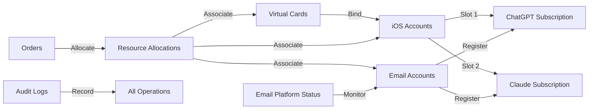

# Franxx Store Backend Management System - Business Model & Database Design

## I. Business Model Overview

### 1.1 Business Positioning

Franxx Store is a cross-region platform providing AI subscription services for Chinese developers, bypassing regional restrictions through Nigerian iOS subscriptions, offering subscription management for ChatGPT, Claude, Gemini, and other AI services.

### 1.2 Core Resource System

```plain
Virtual Cards (Payment Capability)
    ↓ [Binding]
iOS Accounts (Purchase Channel)
    ↓ [Subscription]
AI Service Subscriptions (ChatGPT/Claude/Gemini)
    ↑ [Usage]
Email Accounts (AI Service Account Foundation)
```

### 1.3 Subscription Models

1. **Standard Subscription**: Users purchase complete accounts, we provide pre-registered email accounts
2. **Proxy Subscription Service** (Lv3 Member Exclusive): Users provide their own accounts, we help activate subscriptions
3. **FRANXX Pair Mode** (Duo Team):
   - Two users form a FRANXX unit, sharing each other's subscription benefits
   - User A's ChatGPT + User B's Claude = Both can use both services
   - No cost sharing involved, each maintains their own subscription
4. **FRANXX Squad Mode** (6-person Group Purchase):
   - 6 people form a complete FRANXX squad
   - Enjoy 85% of total price (15% savings per person)
   - Can mix different service subscriptions (ChatGPT/Claude/Gemini)
   - Squad leader manages coordination and fee collection

### 1.4 Key Business Rules

- **iOS Account Limitations**: Each iOS account can subscribe to at most one OpenAI service (ChatGPT) and one Anthropic service (Claude).
- **Payment Channel**: All subscriptions through iOS in-app purchase (leveraging Nigerian region pricing advantage)
- **Account Recycling**: 3-day retention after subscription expiry for renewal, then recyclable for reallocation
- **Renewal Strategy**: Auto-renewal disabled by default, follow up when users actively renew
- **Risk Control Management**: iOS accounts have 24/48/72 hour risk control period after registration
- **Exception Handling**: When email is banned on specific platforms, mark status and process refunds

### 1.5 Business Model & Discount System

Our core business model attracts and retains users through multi-tiered discount incentives based on original pricing:

#### 1.5.1 Discount Types

1. **Membership Level Discounts**
   - Lv1 (New Users): Original price
   - Lv2 (3-month subscription): 95% discount
   - Lv3 (6-month subscription): 90% discount
   - Lv4 (12-month subscription): 85% discount
   - Lv5 (FRANXX Elite): 80% discount

2. **Discount Code System**
   - New user exclusive: 10% off first order
   - Holiday promotions: 15% off on specific holidays
   - Referral rewards: 12% off for referring new users
   - Flash sales: Limited 25% off codes

3. **Team Benefits**
   - 2-person FRANXX Pair: Share subscription benefits (not a discount)
   - 6-person FRANXX Squad: 85% of total price
   - Enterprise bulk purchase (10+ accounts): 70% of total price

4. **Long-term Subscription Discounts**
   - Quarterly: 95% discount
   - Semi-annual: 90% discount
   - Annual: 85% discount

#### 1.5.2 Discount Application Rule (Lowest-Of)

- Compute the payable amount under each category independently: membership level discount, discount code (if provided), and squad discount.
- Apply only one discount: choose the lowest resulting price (non-stacking).
- Optional safety floor: enforce a minimum effective price floor (e.g., 65% of list price) if needed for margin protection.

#### 1.5.3 Member Growth System

- Subscription duration accumulates for upgrades
- Accelerated upgrades for referring new users
- Earn experience points through community activities
- High-level members enjoy priority support, resource allocation privileges

## II. Business Processes

### 2.1 Resource Preparation Process

1. Purchase virtual cards, enter into system
2. Register iOS accounts, bind virtual cards
3. Batch register email accounts
4. Use emails to register free AI service accounts
5. Wait for iOS accounts to pass risk control period

### 2.2 Order Processing Flow

1. User places order selecting service type (ChatGPT/Claude/Gemini)
2. System/admin allocates from resource pool:
   - Select available email account (pre-registered with corresponding AI service)
   - Select iOS account with free subscription slot
3. Purchase subscription through iOS account in-app for that email
4. Record subscription info, mark resource occupancy status
5. Deliver account information to user

### 2.3 Renewal Management Process

1. Notify users when subscription approaching expiry
2. User chooses to renew:
   - Keep original account unchanged
   - Renew through same iOS account
3. User doesn't renew:
   - Enter 3-day retention period
   - Resources released for reallocation after retention period

### 2.4 Exception Handling Process

1. Email banned on specific platform:
   - Mark email status as banned on that platform
   - Contact platform for refund request
   - Reallocate resources or refund user
2. iOS account risk control:
   - Mark risk control status
   - Wait for risk control period to end before use

## III. Database Design

### 3.1 Billing Addresses Table (billing_addresses)

```sql
- id                 UUID PK         // Primary key
- street             TEXT            // Street address
- city_or_town       TEXT            // City
- state_or_county    TEXT            // State/County (e.g., Jigawa)
- postcode           TEXT            // Postal code
- country            TEXT            // Country
- status             ENUM            // active/inactive
- notes              TEXT            // Notes
- created_at         TIMESTAMPTZ
- updated_at         TIMESTAMPTZ

-- Indexes
CREATE INDEX idx_billing_addresses_country ON billing_addresses(country);
CREATE INDEX idx_billing_addresses_status ON billing_addresses(status);
```

### 3.2 Virtual Cards Table (virtual_cards)

```sql
- id                   UUID PK         // Primary key
- pan_encrypted        TEXT UNIQUE     // Encrypted PAN (full card number)
- last4                TEXT            // Last 4 digits (for display)
- brand                ENUM            // visa/mastercard/amex/... 
- expiry_date          DATE            // Expiry date
- cvv_encrypted        TEXT            // Encrypted CVV
- provider             TEXT            // Provider (gomoney/timon/feiyangka)
- holder_name          TEXT            // Cardholder name
- balance              DECIMAL(10,2)   // Balance
- currency             ENUM            // NGN/USD
- status               ENUM            // active/frozen/expired/cancelled
- billing_address_id   UUID FK         // Associated billing address
- monthly_limit        DECIMAL(10,2)   // Monthly limit
- used_this_month      DECIMAL(10,2)   // Used this month
- notes                TEXT            // Notes
- created_at           TIMESTAMPTZ     
- updated_at           TIMESTAMPTZ
```

Note: PAN = Primary Account Number (the full card number). Sensitive fields are stored encrypted and visible to admins only.

### 3.3 iOS Accounts Table (ios_accounts)

```sql
- id                   UUID PK         // Primary key
- apple_id             TEXT UNIQUE     // Apple ID
- password             TEXT            // Password (encrypted)
- region               ENUM            // NG/US/GB/JP
- phone_number         TEXT            // Associated phone
- virtual_card_id      UUID FK         // Associated virtual card
- status               ENUM            // active/locked/risk_control/suspended
- slot_combo           ENUM            // none/openai_only/anthropic_only/both
- risk_control_until   TIMESTAMPTZ     // Risk control end time
- device_info          JSONB           // Associated device info
- last_login_at        TIMESTAMPTZ     // Last login time
- total_spent          DECIMAL(10,2)   // Total amount spent
- notes                TEXT            // Notes
- created_at           TIMESTAMPTZ
- updated_at           TIMESTAMPTZ

-- Consistency suggestion: when status != 'active', enforce slot_combo = 'none' (CHECK constraint in implementation).
```

### 3.4 Email Accounts Table (email_accounts)

```sql
- id                 UUID PK         // Primary key
- email              TEXT UNIQUE     // Email address
- password           TEXT            // Password (encrypted)
- phone_number       TEXT            // Associated phone
- recovery_email     TEXT            // Recovery email
- status             ENUM            // available/allocated/reserved/recycled
- allocation_status  ENUM            // Allocation status
- current_user_id    UUID FK         // Currently allocated user
- allocated_at       TIMESTAMPTZ     // Allocation time
- reserved_until     TIMESTAMPTZ     // Reservation deadline (3 days after expiry)
- notes              TEXT            // Notes
- created_at         TIMESTAMPTZ
- updated_at         TIMESTAMPTZ
```

### 3.5 Email Platform Status Table (email_platform_status)

```sql
- id                 UUID PK         // Primary key
- email_account_id   UUID FK         // Associated email account
- platform           ENUM            // openai/anthropic
- status             ENUM            // active/banned/suspended
- banned_at          TIMESTAMPTZ     // Ban time
- ban_reason         TEXT            // Ban reason
- registered_at      TIMESTAMPTZ     // Platform registration time
- last_active_at     TIMESTAMPTZ     // Last active time
- created_at         TIMESTAMPTZ
- updated_at         TIMESTAMPTZ

UNIQUE(email_account_id, platform)     // Composite unique index
```

### 3.6 Products Table (products)

```sql
- id                 UUID PK         // Primary key
- name               TEXT            // Product name (e.g., ChatGPT Plus, Claude Pro)
- platform           ENUM            // openai/anthropic (determines iOS slot provider)
 - tag                ENUM            // Service identifier (chatgpt/claude/codex/claude_code)
- ios_ngn_price      DECIMAL(10,2)   // iOS Store Nigerian price (cost)
- ios_usd_price      DECIMAL(10,2)   // iOS USD converted price (cost)
- web_usd_price      DECIMAL(10,2)   // Web version USD price (reference)
- selling_price      DECIMAL(10,2)   // Our selling price (USD)
- stock_quantity     INTEGER         // Stock quantity
- reserved_quantity  INTEGER         // Reserved (ordered but unpaid)
- sold_quantity      INTEGER         // Sold quantity
- status             ENUM            // on_sale/sold_out/discontinued
- description        TEXT            // Product description
- created_at         TIMESTAMPTZ
- updated_at         TIMESTAMPTZ
```

### 3.7 Orders Table (orders)

```sql
- id                 UUID PK         // Primary key
- user_id            UUID FK         // Ordering user
- product_id         UUID FK         // Product purchased
- subscription_id    UUID FK         // Associated subscription
- type               ENUM            // new/renewal
- amount             DECIMAL(10,2)   // List price before discounts
- final_amount       DECIMAL(10,2)   // Final price after discount
- discount_type      ENUM            // applied: membership/code/squad/none
- discount_snapshot  JSONB           // Calculation snapshot for auditing
- currency           ENUM            // USD/CNY
- payment_status     ENUM            // pending/paid/partially_refunded/refunded/canceled (derived from payments)
- delivery_status    ENUM            // pending/processing/delivered/failed
- stripe_session_id  TEXT            // Stripe payment session ID
- notes              TEXT            // Notes
- created_at         TIMESTAMPTZ
- paid_at            TIMESTAMPTZ
- delivered_at       TIMESTAMPTZ
```

#### 3.7.1 Payments Table (payments)

Used to record all payment attempts, successes, and refunds for an order. Orders keep a fast-changing `payment_status` snapshot derived from these rows.

```sql
- id                        UUID PK         // Primary key
- order_id                  UUID FK         // Associated order
- provider                  ENUM            // stripe (only)
- kind                      ENUM            // charge/refund
- amount                    DECIMAL(10,2)   // Positive numbers; refunds negate via kind
- currency                  ENUM            // USD/CNY
- status                    ENUM            // pending/authorized/succeeded/failed/canceled/disputed/refunded/partially_refunded
- stripe_session_id         TEXT            // Checkout Session id (cs_...)
- stripe_payment_intent_id  TEXT            // PaymentIntent id (pi_...)
- stripe_charge_id          TEXT            // Charge id (ch_...) for charges
- stripe_refund_id          TEXT            // Refund id (re_...) for refunds
- stripe_customer_id        TEXT            // Customer id (cus_...) if available
- stripe_event_id           TEXT            // Webhook event id (evt_...) used for idempotency
- error_message             TEXT            // Failure reason (optional)
- occurred_at               TIMESTAMPTZ     // When event occurred
- created_at                TIMESTAMPTZ
- updated_at                TIMESTAMPTZ

-- Suggested unique constraints / indexes (implementation):
-- UNIQUE(stripe_event_id)
-- UNIQUE(stripe_charge_id) WHERE kind = 'charge'
-- UNIQUE(stripe_refund_id) WHERE kind = 'refund'
-- INDEX(order_id, created_at DESC)
```

#### 3.7.2 Stripe Checkout Flow (one‑time payments)

Recommended server-driven flow with webhooks:

1) Create Checkout Session on server with `mode=payment`, price/amount from the server‑side computed `final_amount`, and set `success_url=".../after-checkout?session_id={CHECKOUT_SESSION_ID}"`.
2) Redirect user to the Session URL; user completes payment on Stripe Checkout.
3) Handle webhooks and update `orders`/`payments` atomically. Minimal events to listen for:
   - `checkout.session.completed`: create/confirm the payment row and link `order_id` ⇄ `stripe_session_id`.
   - `payment_intent.succeeded`: mark charge as `succeeded` and persist `stripe_payment_intent_id`/`stripe_charge_id`.
   - `payment_intent.payment_failed`: mark attempt `failed` with `error_message`.
   - `checkout.session.expired`: mark pending attempts as `canceled` if user abandons flow.
   - `refund.created` (and optionally `refund.updated`): insert a `payments` row with `kind='refund'`; recompute order snapshot.
   - Optionally `charge.dispute.created`: set `status='disputed'` for visibility.

Notes and best practices:
- Verify webhook signature with the endpoint secret; respond quickly (2xx) and process asynchronously. Use unique constraints on `stripe_event_id` to make handlers idempotent.
- For fulfillment, prefer webhooks (don’t trust client redirects alone). `checkout.session.completed` signals Checkout finished; `payment_intent.succeeded` is the source of truth for a successful charge.
- Include `{CHECKOUT_SESSION_ID}` in `success_url` and ensure your endpoint acknowledges promptly.

Derived snapshot rule examples (implementation detail):
- pending: no succeeded charges and at least one in-progress payment
- paid: sum(charges) - sum(refunds) >= final_amount
- partially_refunded: 0 < net_paid < final_amount and at least one refund
- refunded: net_paid = 0 and at least one refund

### 3.8 Subscriptions Table (subscriptions)

```sql
- id                 UUID PK         // Primary key
- user_id            UUID FK         // Subscription owner
- product_id         UUID FK         // Subscribed product
- email_account_id   UUID FK         // Email account used (provided by us, nullable)
- custom_email       TEXT            // User-provided email (Lv3 mode, nullable)
- ios_account_id     UUID FK         // iOS account used for purchase
- current_order_id   UUID FK         // Latest order
- first_order_id     UUID FK         // First order
- status             ENUM            // active/expired/cancelled/suspended
- start_date         DATE            // Start date
- end_date           DATE            // End date
- renewal_count      INTEGER         // Renewal count
- apple_receipt      TEXT            // Apple purchase receipt
- created_at         TIMESTAMPTZ
- updated_at         TIMESTAMPTZ

-- Ensure email is one or the other
CHECK ((email_account_id IS NOT NULL AND custom_email IS NULL) OR 
       (email_account_id IS NULL AND custom_email IS NOT NULL))
```

### 3.9 User Membership Levels Table (user_membership_levels)

```sql
- id                 UUID PK         // Primary key
- user_id            UUID FK UNIQUE  // User ID (unique)
- level              INTEGER         // Membership level (1-5)
- experience_points  INTEGER         // Experience points
- total_subscribed_months INTEGER    // Total subscribed months
- total_spent        DECIMAL(10,2)   // Total amount spent
- referral_count     INTEGER         // Number of referred users
- discount_rate      DECIMAL(3,2)    // Discount rate enjoyed (0.80 = 80%)
- next_level_at      INTEGER         // Experience needed for next level
- perks              JSONB           // Privilege configuration
- created_at         TIMESTAMPTZ
- updated_at         TIMESTAMPTZ
```

### 3.10 Discount Codes Table (discount_codes)

```sql
- id                 UUID PK         // Primary key
- code               TEXT UNIQUE     // Discount code
- type               ENUM            // new_user/holiday/referral/flash_sale/custom
- discount_type      ENUM            // percentage/fixed_amount
- discount_value     DECIMAL(10,2)   // Discount value (percentage or fixed amount)
- min_purchase       DECIMAL(10,2)   // Minimum purchase amount
- max_discount       DECIMAL(10,2)   // Maximum discount amount
- usage_limit        INTEGER         // Total usage limit
- usage_count        INTEGER         // Used count
- user_limit         INTEGER         // Per-user usage limit
- valid_from         TIMESTAMPTZ     // Valid from
- valid_until        TIMESTAMPTZ     // Valid until
- applicable_products JSONB          // Applicable product list
- status             ENUM            // active/expired/disabled
- created_by         UUID FK         // Creator
- created_at         TIMESTAMPTZ
```

### 3.11 FRANXX Squads Table (franxx_squads)

```sql
- id                 UUID PK         // Primary key
- squad_name         TEXT            // Squad name
- squad_code         TEXT UNIQUE     // Squad invite code
- leader_user_id     UUID FK         // Squad leader user ID
- discount_rate      DECIMAL(3,2)    // Discount rate (0.85 = 85% off)
- max_members        INTEGER         // Maximum members (6)
- active_members_count INTEGER       // Current active members (with subscriptions)
- min_active_required INTEGER        // Minimum active members required (4)
- status             ENUM            // forming/active/warning/disbanded
- warning_status     ENUM            // normal/warning
- warning_until      DATE            // Warning period deadline
- formed_at          TIMESTAMPTZ     // Formation time
- disbanded_at       TIMESTAMPTZ     // Disbanding time
- created_at         TIMESTAMPTZ
- updated_at         TIMESTAMPTZ
```

### 3.12 Squad Members Table (squad_members)

```sql
- id                 UUID PK         // Primary key
- squad_id           UUID FK         // Squad belonged to
- user_id            UUID FK         // User ID
- role               ENUM            // leader/member
- status             ENUM            // active/expired/grace_period/removed
- subscription_status ENUM           // active/expired/none
- grace_period_until DATE            // Personal grace period deadline (removed after 3 months without subscription)
- total_months       INTEGER         // Total months subscribed in squad
- last_order_date    DATE            // Last order date
- joined_at          TIMESTAMPTZ     // Join time
- left_at            TIMESTAMPTZ     // Leave time
- remove_reason      TEXT            // Removal reason
- created_at         TIMESTAMPTZ
- updated_at         TIMESTAMPTZ

UNIQUE(squad_id, user_id)
```

### 3.13 FRANXX Pairs Table (franxx_pairs)

```sql
- id                 UUID PK         // Primary key
- stamen_id          UUID FK         // Stamen (male pilot)
- pistil_id          UUID FK         // Pistil (female pilot)
- status             ENUM            // active/dissolved
- paired_at          TIMESTAMPTZ     // Pairing time
- dissolved_at       TIMESTAMPTZ     // Dissolution time
- created_at         TIMESTAMPTZ

-- Constraint: Ensure users can only be in one pair
CREATE UNIQUE INDEX idx_stamen_pair ON franxx_pairs(stamen_id) WHERE status = 'active';
CREATE UNIQUE INDEX idx_pistil_pair ON franxx_pairs(pistil_id) WHERE status = 'active';
```

### 3.14 Discount Usage Logs Table (discount_usage_logs)

```sql
- id                 UUID PK         // Primary key
- user_id            UUID FK         // User ID
- order_id           UUID FK         // Order ID
- discount_code_id   UUID FK         // Discount code ID (optional)
- discount_type      ENUM            // code/membership/squad/long_term
- original_price     DECIMAL(10,2)   // Original price
- discount_amount    DECIMAL(10,2)   // Discount amount
- final_price        DECIMAL(10,2)   // Final price
- stacked_discounts  JSONB           // Stacked discount details
- created_at         TIMESTAMPTZ
```

### 3.15 Refund Requests Table (refund_requests)

```sql
- id                 UUID PK         // Primary key
- order_id           UUID FK         // Associated order
- subscription_id    UUID FK         // Associated subscription
- user_id            UUID FK         // Requesting user
- reason             TEXT            // Refund reason (account banned, etc.)
- ban_platform       ENUM            // chatgpt/claude (which platform banned)
- request_amount     DECIMAL(10,2)   // Requested refund amount
- approved_amount    DECIMAL(10,2)   // Approved refund amount
- status             ENUM            // pending/reviewing/approved/rejected/completed
- admin_notes        TEXT            // Admin notes
- stripe_refund_id   TEXT            // Stripe refund ID
- requested_at       TIMESTAMPTZ     // Request time
- reviewed_at        TIMESTAMPTZ     // Review time
- reviewed_by        UUID FK         // Reviewing admin
- completed_at       TIMESTAMPTZ     // Refund completion time
- created_at         TIMESTAMPTZ
```

### 3.16 Virtual Card Topups Table (virtual_card_topups)

```sql
- id                 UUID PK         // Primary key
- virtual_card_id    UUID FK         // Virtual card ID
- amount             DECIMAL(10,2)   // Topup amount
- currency           TEXT            // Currency type
- provider_order_id  TEXT            // Card provider order ID
- topup_method       TEXT            // Topup method
- status             ENUM            // pending/success/failed
- operator_id        UUID FK         // Operator
- notes              TEXT            // Notes
- created_at         TIMESTAMPTZ
- completed_at       TIMESTAMPTZ
```

### 3.17 Virtual Card Transactions Table (virtual_card_transactions)

```sql
- id                 UUID PK         // Primary key
- virtual_card_id    UUID FK         // Virtual card ID
- subscription_id    UUID FK         // Associated subscription (if subscription expense)
- transaction_type   ENUM            // subscription/refund/other
- amount             DECIMAL(10,2)   // Transaction amount
- currency           TEXT            // Currency type
- merchant           TEXT            // Merchant name (Apple/other)
- provider_trans_id  TEXT            // Card provider transaction ID
- our_order_id       UUID            // Our order ID
- status             ENUM            // pending/completed/failed/reversed
- transaction_date   TIMESTAMPTZ     // Transaction date
- notes              TEXT            // Notes
- created_at         TIMESTAMPTZ
```

## IV. Key Feature Design

### 4.1 Resource Allocation Algorithm

1. Find available resources based on order requirements
2. Prioritize resources with high health scores
3. Consider load balancing to avoid overuse of single resources
4. Support both manual specification and automatic allocation

### 4.2 Risk Control Monitoring

1. Automatic marking of iOS account risk control periods
2. Real-time monitoring of email platform status
3. Virtual card balance alerts
4. Abnormal usage pattern detection

### 4.3 Renewal Management

1. Automated expiry reminders
2. Retention period management
3. Automatic resource recycling mechanism
4. Renewal orders prioritize original resources

### 4.4 FRANXX Squad Management Mechanism

#### Squad Maintenance Rules

1. **Formation Requirements**: 6 people required to form, 85% discount effective immediately upon formation
2. **Activity Requirements**: At least 4 people with active subscriptions to maintain squad
3. **Warning Mechanism**:
   - When active members < 4, squad enters 30-day warning period
   - If 4 active members restored during warning period, returns to normal
   - If still less than 4 after warning period, squad automatically disbanded

#### Individual Qualification Maintenance

1. **Grace Period**: 3-month grace period after subscription expiry
2. **Auto Removal**: Automatically removed from squad after 3 consecutive months without subscription
3. **Rejoin**: Can reapply to join after removal (if squad has vacancies)
4. **Leader Privileges**: Leader can actively remove inactive members

#### Discount Application

1. System automatically checks if user belongs to active squad when placing order
2. If in active squad, automatically applies 85% discount
3. Discount can stack with membership level discount (take best)

### 4.5 FRANXX Pair Mechanism

1. **Pairing Logic**:
   - Two people form a FRANXX unit, sharing each other's subscription benefits
   - User A has ChatGPT, User B has Claude → Both can use both services after pairing
   - One user can only be in one pair at a time

2. **Benefit Access**:
   - When pair status is active, automatically gain access to partner's all subscriptions
   - When querying subscriptions, return own + partner's subscription list
   - Immediately lose partner's subscription access upon dissolution

3. **Simple Implementation**:
   - Only record pairing relationship, not specific sharing details
   - Implement benefit sharing through JOIN queries
   - Password management handled by subscription owner

## V. Data Relationship Diagram



## VI. Technical Implementation Points

### 6.1 Security

- Sensitive information (passwords, CVV, 2FA keys) must be encrypted
- Implement Row Level Security (RLS)
- Audit logs record all critical operations
- API access requires permission verification

### 6.2 Performance Optimization

- Create indexes for high-frequency query fields
- Use views to optimize statistical queries
- Implement database connection pooling
- Consider read-write separation architecture

### 6.3 Scalability

- Table structure supports multi-platform expansion
- Status enums facilitate adding new statuses
- JSONB fields store flexible data
- Reserved extension fields

### 6.4 Monitoring and Alerts

- Resource inventory below threshold alerts
- Virtual card insufficient balance warnings
- Abnormal login detection
- Subscription expiry reminders

## VII. Future Optimization Directions

1. **Automation Enhancement**
   - Automatic resource allocation engine
   - Intelligent risk control scoring system
   - Automated renewal processing flow

2. **Data Analysis Capabilities**
   - User behavior analysis
   - Resource utilization efficiency analysis
   - Cost-benefit analysis

3. **Multi-region Support**
   - Support more countries/regions
   - Multi-currency payment support
   - Regional pricing strategies

4. **API Interface Improvement**
   - RESTful API design
   - GraphQL support
   - Webhook event notifications
